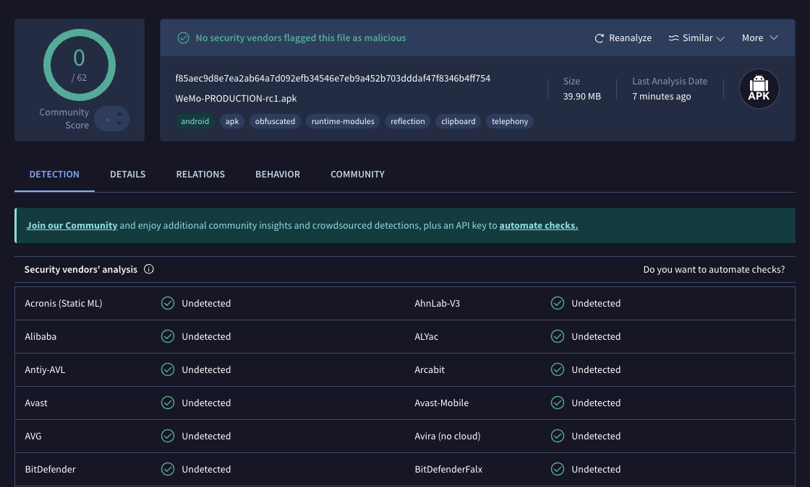

# WeMo Local Control APK

**WeMo-PRODUCTION-rc1.apk** — WeMo production release, version 1.24.

## Overview

This is an older production release of the WeMo Android app that supports **local control** of WeMo devices via **UPnP** (Universal Plug and Play). Unlike newer versions that rely on cloud connectivity, this version can discover and control WeMo devices directly on the local network.

## Key Feature

- **Local UPnP Control** — Communicate with WeMo devices over the local network without requiring cloud services or an internet connection.

## Details

| Field      | Value                              |
|------------|------------------------------------|
| File       | `WeMo-PRODUCTION-rc1.apk`          |
| Version    | 1.24                               |
| Platform   | Android                            |
| Protocol   | UPnP                               |
| Build Type | Production (RC1)                   |
| MD5        | `9fcf6ff824a3f4dd7626e22009b206eb` |

## Installation

1. Copy the APK to your Android device.
2. Enable **Install from unknown sources** in device settings.
3. Open the APK file to install.

## Usage

1. Ensure your Android device and WeMo devices are on the same local network (connected to the same Wi-Fi).
2. Launch the WeMo app.
3. The app will discover WeMo devices on the network via UPnP.
4. Control devices (on/off, scheduling, etc.) directly through local communication.

## Security Scan

This APK has been scanned on [VirusTotal](https://www.virustotal.com/gui/home/upload) and confirmed to contain no viruses.

- [VirusTotal Detection Report](https://www.virustotal.com/gui/file/f85aec9d8e7ea2ab64a7d092efb34546e7eb9a452b703dddaf47f8346b4ff754/detection)

## Important Notice

This APK may be automatically upgraded to the newest WeMo version by Google Play Store, which removes local control support. To prevent this, manually disable auto-update for the WeMo app in the Google Play Store:

1. Open **Google Play Store**.
2. Search for **WeMo** and open the app page.
3. Tap the **three-dot menu** (⋮) in the top-right corner.
4. Uncheck **Enable auto update**.

## Notes

- This is a legacy release preserved for local control capability.
- No internet connection is required for device control once discovered.
- Compatibility with newer Android versions is not guaranteed.

## Disclaimer

This repository contains a legacy WeMo APK that supports local UPnP control.

The APK is proprietary software owned by Belkin.
This repository is for archival purposes only.
